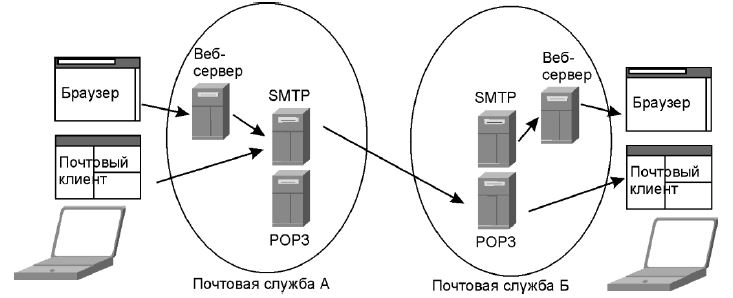
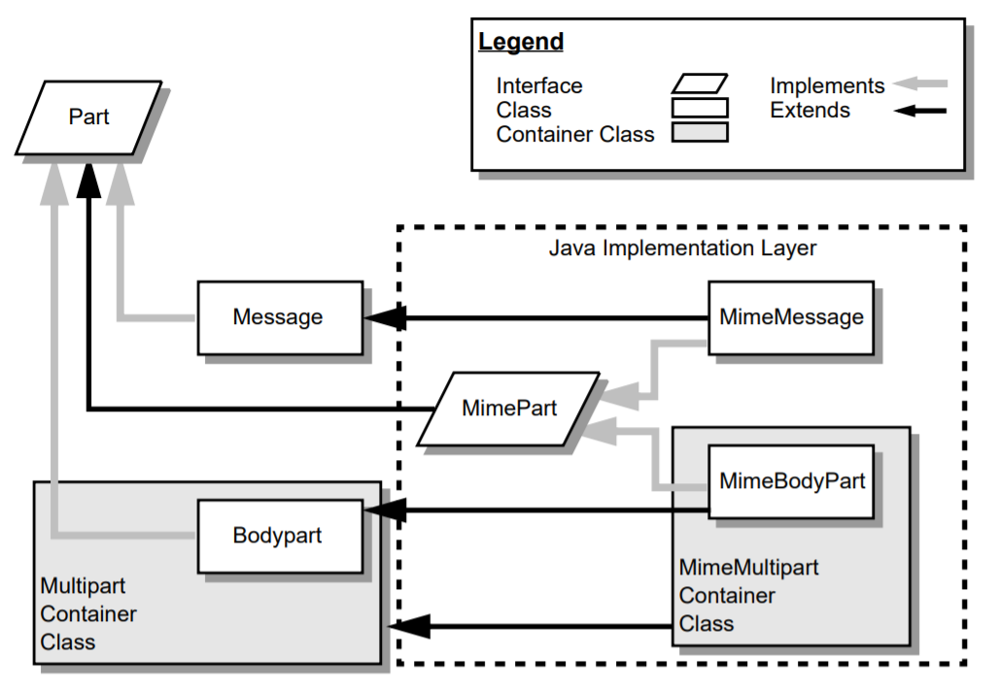
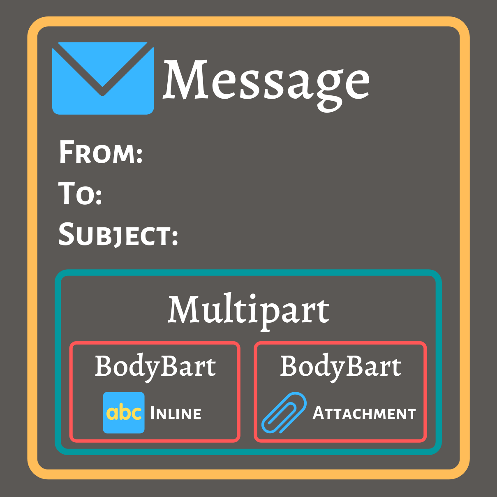
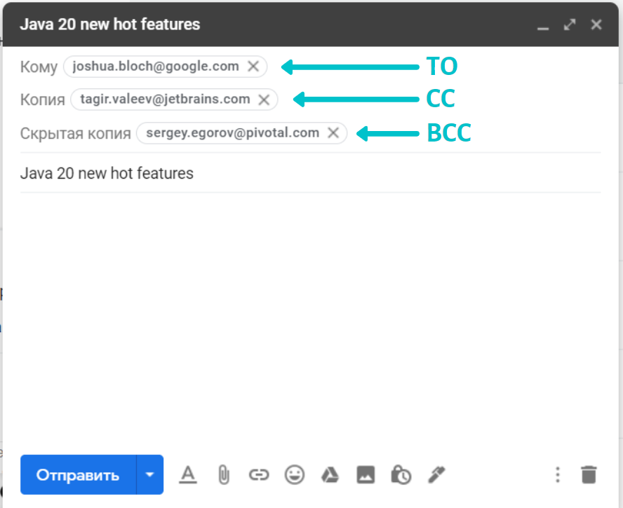

# Электронная почта и работа с ней в Java-приложениях

Эту статью я решил написать, потому что не нашел русскоязычных 
источников про работу c электронной почтой из Java, описывающих 
имеющиеся библиотеки достаточно полно.
На хабре существует [статья][habr-read-email], посвященная очень узкой 
задаче по чтению писем (и выводу их содержимого в консоль) и 
[статья][habr-spring-email] с how-to по отправлению
письма с вложениями при помощи Spring Email.
Также существует несколько статей ([например][javax-mail-info])
на тематических ресурсах, которые приводят порядок действий при работе 
с электронной почтой.
В этих источниках мне не хватало объяснения основ, на которых стоит
электронная почта и взгляда с высоты на существующие библиотеки
для работы с почтой в Java.

Для таких же лапкообразных, как я, написана эта статья.
Она дает общие представления о работе электронной почты, разъясняет 
основные сущности библиотеки Jakarta Mail и дает советы о том, как 
работать с электронной почтой в Spring-приложениях. 

Содержание:
1. Электронная почта
2. Работа с электронной почтой с помощью Jakarta Mail
3. Работа с электронной почтой в среде Spring

-------------------------------------------------
## 1. Электронная почта

Сегодня электронная почта кажется устаревшей технологией, которая нужна
только для того чтобы зарегистрироваться на сайтах, куда забыли прикрутить
авторизацию с помощью Google, Vk или Facebook -аккаунта.
Возможно, так и есть, но наверняка вы до сих пор получаете электронные письма
о падении сборки от вашего CI-инструмента или уведомления о пул-реквестах
от вашего репозитория на свой почтовый ящик.

Электронная почта была создана на заре интернета и позаимствовала многие
свои идеи из реального мира.
Подобно тому как в оффлайне для отправки и получения писем нам требуются 
почтовые отделения, в электронной почте нам нужны почтовые сервера, т.е.
электронная почта основана на модели клиент-сервер.
В крупных компаниях сисадмины разворачивают свои собственные почтовые сервера, 
в маленьких компаниях используют почтовые сервера, предоставляемые 
специальными провайдерами, например: Яндекс.Почта, Gmail и др.

Популярные почтовые серверы: Postfix, Sendmail, [Apache James](http://james.apache.org/), 
Zimbra.

Для работы с письмами на стороне клиента используются десктопные приложения
вроде Outlook или The Bat!, либо веб-приложения вроде Gmail или Яндекс.Почта.

Предположим, что человек А решил отправить письмо человеку Б. 
Он пишет его на своем компьютере (телефоне / планшете) и нажимает 
кнопку "отправить". 
Письмо отправляется по протоколу SMTP на почтовый сервер клиента А.
Этот почтовый сервер пересылает письмо почтовому серверу клиенту Б 
также при помощи протокола SMTP.
Когда клиент Б решит проверить почту, он сделает запрос к своему почтовому 
серверу с помощью протокола POP3 или IMAP. 
В случае использования протокола POP3 письма будут выкачены на устройство 
клиента Б и удалены с почтового сервера. 
При использовании протокола IMAP клиенту Б будут переданы копии писем, 
а оригиналы останутся храниться на почтовом сервере.


### Электронное письмо

Электронное письмо состоит из следующих частей:
* Заголовки - тема письма, адрес отправителя, адреса получателей и служебная 
информация.
* Тело письма - текст, html, картинки, вложения.

Раньше тело письма могло состоять только из символов ASCII, но с развитием 
почтовых систем, появилась возможность добавлять в тело html-разметку, 
изображения, а также прикладывать к письму различные файлы. 
Для того чтобы правильно выделять различные части из письма, были 
разработаны MIME-типы - многоцелевые расширения интернет-почты.

Для отправки писем используется протокол SMTP. 
А для их приема используется либо протокол POP3, либо IMAP.

Существуют и другие почтовые протоколы, но три перечисленных выше - 
наиболее популярны.

### Почтовые протоколы

Все почтовые протоколы относятся к самому высокому уровню модели OSI и 
основаны на TCP.
У каждого из нижеперечисленных протоколов существует защищенная версия, 
основанная на SSL.

#### SMTP

Simple Mail Transfer Protocol - простой протокол передачи писем. 
Используется для рассылки писем.

SMTP использует порт 25 или 587. 
А его защищенная версия SMTPS слушает порт 465.

#### POP3

Post Office Protocol v3 - почтовый протокол. 
Используется для чтения писем. 
POP3 при выкачивании письма на клиентский компьютер удаляет письмо с 
почтового сервера.
Недостатком этого протокола является то, что при просмотре письма на 
одном клиентском компьютере это письмо уже нельзя будет посмотреть с 
другого устройства.

POP3 слушает порт 110. А его защищенная версия POP3S слушает порт 995.

#### IMAP

Internet Message Access Protocol - протокол доступа к электронной почте. 
Альтернатива протоколу POP3. 
IMAP подгружает на клиент только мета-информацию письма, а остальные 
данные предоставляет по требованию.

IMAP слушает порт 143. А его защищенная версия IMAPS слушает порт 993.

### MIME-типы

Multipurpose Internet Mail Extensions - многоцелевые расширения интернет-почты.
MIME используется, для того чтобы обозначить тип передаваемого контента с 
помощью протоколов, которые первоначально были предназначены только для 
передачи текстовой информации, например SMTP и HTTP.

MIME первоначально предназначался для электронной почты, но впоследствии 
начал использоваться не только в ней, но и в HTTP.

Тип определяется двумя словами, записанными через прямой слеш. 
Первое слово - это общий тип, а второе - уточнение.
```
image/jpeg
```

MIME позволяет устанавливать иерархию вложенности одних блоков 
контента в другие. 
При этом блоки контента могут быть смешанного содержимого.
Для таких блоков используется общий тип `multipart`, нам еще встретится 
этот термин.

-------------------------------------------------
## 2. Работа с электронной почтой с помощью Jakarta Mail

Jakarta Mail - это библиотека / фреймворк, использующийся для создания, 
отправки и чтения электронной почты из Java-кода.
Библиотека входит в состав Jakarta EE.
Ранее библиотека называлась JavaMail, но с 2017 года она переехала под 
крыло Jakarta.

Как принято в Java EE, сама библиотека предоставляет только базовые сущности, 
не зависящие от конкретных реализаций. 
Эти основные классы находятся в пакете `javax.mail`.
Помимо этого к библиотеке прикладывается Reference Implementation для 
основных протоколов - SMTP, POP3, IMAP. 
Все классы, относящиеся к этим протоколам, находятся в пакете `com.sun.mail`.
Для использования других протоколов, не входящих в Reference Implementation, 
необходимо подключать сторонние библиотеки.

Для обработки различных форматов данных, которые могут быть вложены 
в электронное письмо, Jakarta Mail использует библиотеку JavaBeans 
Activation Framework - при использовании автоматического сборщика 
эта зависимость будет подтянута в ваш проект транзитивно.

На текущий момент актуальной версией Jakarta Mail 
является 1.6.5, но близится выпуск версии 2.0.0, главным 
"нововведением" которого станет переименование основного пакета с 
`javax.mail` на `jakarta.mail`.

В Jakarta Mail не входит почтовый сервер. Для отправки писем по SMTP или 
получения по IMAP или POP3 требуется развернуть собственный почтовый сервер 
или использовать существующий.

### Настройка почтовых серверов

Как следует из первой части, для отправки и получения электронных писем
необходимо поддерживать соединение с почтовыми серверами.
В Jakarta Mail почтовые сервера представляют объекты классов `Transport`
и `Store` для отправления и чтения писем соответственно.

Настройка соединения с почтовыми серверами происходит с помощью
пар ключ-значение, передаваемых в виде объекта класса `Properties`. 
Например для настройки SMTP-соединения с почтовым сервером Яндекс.Почты
достаточно следующих параметров:
```properties
mail.transport.protocol = smtps
mail.smtp.host = smtp.yandex.ru
mail.smtp.port = 465
mail.smtp.user = artem.boiar
mail.smtp.ssl.enable = true
mail.smtp.auth = true
mail.debug = true
```
Полный список различных настроек и их описание можно найти в [документации 
на пакеты][mail-properties] основной библиотеки и ее реализаций для различных
протоколов.


#### Сессия

На основе объекта `Properties` создается сессия:
```java
final Session session = Session.getInstance(mailProperties, authenticator);
``` 
Обычно сессия создается одна для всего приложения. 
Она представляет собой сеанс работы с почтовыми серверами.
Почти каждый объект библиотеки должен принадлежать какой-либо сессии. 


#### Аутентификация

Вторым аргументом при создании сессии необходимо передать объект
абстрактного класса `Authenticator`, у которого требуется переопределить
метод `getPasswordAuthentication()` (по умолчанию возвращает null, 
почему он не был сделан абстрактным - неизвестно).

Этот метод используется сессией для связи с почтовым сервером - метод
будет вызываться при каждом обращении к серверу.
При его вызове возвращается объект класса `PasswordAuthentication`, 
который представляет собой обычное DTO для хранения логина и пароля.
```java
final Authenticator authenticator = new Authenticator() {
    @Override
    protected PasswordAuthentication getPasswordAuthentication() {
        return new PasswordAuthentication(
            this.getDefaultUserName(),
            PropUtils.getPassword()
        );
    }
}
```
Разработчиками библиотеки подразумевается, что внутри этого метода можно 
запросить пароль у пользователя или достать его из хранилища. 
При получении пароля можно пользоваться значениями полей класса 
`Authenticator`: IP почтового сервера, тип протокола, используемый 
порт и даже имя дефолтного пользователя.


Почти все сущности, представляющие какие-либо объекты предметной
области, представлены абстрактными классами, реализация которых 
зависит от конкретного протокола: 
* `Message`, представляющий электронное письмо;
* `BodyPart`, представляющий фрагмент электронного письма: основная часть 
или вложение;
* `Address`, представляющий адрес отправителя или получателя;
* `Folder`, представляющий собой папку, в которой хранятся электронные письма;
* `SearchTerm`, представляющий собой условие поиска в папке по письмам;
* `MailEvent` для обработки событий (получение письма). 
Обработка событий основывается на паттерне Наблюдатель.

*Примечание* - в данной статье обработка событий не рассмотрена.


### Письма



Электронные письма представляются с помощью абстрактного класса `Message`, 
у которого есть один наследник - `MimeMessage` (реализации различных 
протоколов могут дополнительно расширять этот класс).



Электронное письмо состоит из метаинформации: отправитель, получатели, тема, 
дата отправки и др.,- и основной части: текст и вложения.
Основная часть письма представлена в виде фрагментов `BodyPart`, которые 
хранятся в контейнере `Multipart`. Подробнее о фрагментах - ниже.

Каждое письмо привязывается к конкретной сессии. 
При создании нового письма в конструктор передается объект сессии:
```java
final Message message = new MimeMessage(session);
```

Для установки значений полей метаинформации используются обычные сеттеры.
При установке получателей необходимо указывать еще тип адресантов, 
для этого у класса `Message` есть внутренний класс `RecipientType`, 
который представляет собой различные виды адресантов:
* `TO` - прямой получатель;
* `CC` - получатель копии;
* `BCC` -  получатель скрытой копии.

Поля с такими названиями можно найти в интерфейсе любого почтового клиента 
при написании письма.



```java
message.setFrom("artem.boiar@yandex.ru");
message.setRecipients(Message.RecipientType.TO, "joshua.bloch@google.com");
message.setRecipients(Message.RecipientType.CC, "tagir.valeev@jetbrains.com");
message.setRecipients(Message.RecipientType.BCC, "sergey.egorov@pivotal.com");
message.setSubject("Java 20 new hot features");
```


#### Флаги

При чтении писем можно изменять их состояние, устанавливая им различные флаги.
Стандартные флаги представлены в классе `Flags`:
* `ANSWERED` - отвечено
* `DELETED` - удалено
* `DRAFT` - черновик
* `FLAGGED` - выделено
* `RECENT` - недавнее
* `SEEN` - просмотрено
* `USER` - пользовательский флаг

Флаги устанавливаются в сообщении в нужное положение с помощью метода 
`setFlag(Flag, boolean set)`.


### Адреса

Адреса используются для идентификации получателя письма. 

Класс `Address` является абстрактным и по сути имеет всего одну 
реализацию - `InternetAddress` (есть еще `NewsAddress` для мамонтов, 
пользующихся Usenet'ом).

`InternetAddress` представляет привычные нам адреса электронной почты, 
записанные в формате:
```
trisha.gee@jetbrains.com
```
Помимо адреса объекты могут хранить в себе имя адресанта в любой кодировке:
```
internetAddress.setPersonal("Сергей Куксенко");
```
Для того чтобы создать объект `InternetAddress` можно воспользоваться 
одним из конструкторов, либо распарсить строку с несколькими адресами в массив:
```java
InternetAddress[] recipients = InternetAddress.parse(
    "kuksenko@oracle.com, baruh@jfrog.com, golodnyj@yandex.ru");
```

*Примечание* - для валидации адресов электронной почты, приходящих от 
пользователя в виде строк можно пользоваться аннотацией `@Email`, 
объявленной в библиотеке **Bean Validation**.


### Фрагменты письма

Фрагмент письма - это неделимая часть письма, несущая полезную нагрузку
адресанту. Фрагмент письма может либо относиться к основной части письма, 
либо быть вложением.
В Jakarta Mail фрагмент письма представлен абстрактным классом `BodyPart` и
его реализацией `MimeBodyPart`.
Тип фрагмента определяется параметром `disposition`:
- `INLINE` для основной части письма и
- `ATTACHMENT` для вложения.

Тип фрагмента можно не объявлять явно, чаще всего он выводится автоматически, 
в зависимости от того, что записано во фрагмент.

Наиболее часто используемые MIME-типы для частей: 
- `text/plain` для основной части письма и 
- `application/octet-stream` для вложений.

Для создания фрагмента письма можно пользоваться обычным конструктором:
```java
final MimeBodyPart mailBody = new MimeBodyPart();
final MimeBodyPart attachment = new MimeBodyPart();
```

На UML-диаграмме наследования, приведенной выше, объявлен еще интерфейс `Part`,
который реализуется почти всеми классами, относящимися к письму.
В нем объявлены методы доступа к метаинформации письма.
Это довольно странное решение - как-будто у различных фрагментов одного 
письма могут быть различные адресанты или темы письма. 

#### Запись контента
После создания фрагмента необходимо записать в него полезную нагрузку.
Для основной части используется метод `setText()`, а для вложения - 
`attachFile()` или `setContent()`.
**todo написать про DataHandler**
```java
mailBody.setText("Java 20 new features.\nLook at the attachments.");
attachment.attachFile(file);
```
MIME-тип вложения определяется автоматически по расширению файла. 

#### Чтение контента
Для чтения контента из пришедшего письма можно воспользоваться методом
`void saveFile(File)` для сохранения контента на диск или 
`void writeTo(OutputStream)` для перенаправления контента в указанный поток.

#### Мультифрагменты
Фрагменты `BodyPart` для помещения в письмо объединяются в структуру `Multipart`. 
`MimeBodyPart` соответственно объединяются в структуру `MimeMultipart`.
```java
final Multipart multipart = new MimeMultipart();
for (BodyPart bodyPart: bodyParts) {
    //cannot use streams because of throwing exception
    multipart.addBodyPart(bodyPart);
}
```
После этого мультипарт вкладывается в письмо:
```java
message.setContent(multipart);
```

### Папка с письмами

Для хранения писем на почтовом сервере используются папки. 
Обычно папка по умолчанию называется `INBOX` (в POP3 это единственная папка).

Папки организуют древовидную структуру. 
В некоторых реализациях папки могут хранить в себе что-то одно: 
папки или письма, - в других (например, IMAP) сразу и то, и другое.

Папка может находиться в открытом и закрытом состоянии.
При извлечении папки она находится в закрытом состоянии. 
Чтобы прочитать письма, находящиеся в ней, необходимо сначала открыть 
ее `open(int mode)` в одной из двух режимов: только для чтения `READ_ONLY` 
или на чтение и запись - `READ_WRITE`.
```java
Folder folder = store.getDefaultFolder();
folder.open(Folder.READ_WRITE);
```
Операции с содержимым папки могут выполняться только в открытом состоянии, 
а операции над самой папкой только в закрытом состоянии.

Для извлечения писем из папки можно использовать метод `getMessages()`, 
возвращающий все письма из папки:
```java
Message[] messages = folder.getMessages();
```
Письма располагаются в папке аналогично списку и имеют номера, начиная с `1`. 
Для получения писем по их порядковым номерам используются разновидности 
приведенного выше метода.

При использовании протокола IMAP из папки достаются легковесные объекты 
вместо полноценных сообщений. 
Необходимые части сообщения подтягиваются с почтового сервера по требованию, 
либо можно сразу загрузить полную версию письма, 
вызвав метод `fetch()` класса Folder, передав в него желаемые письма.

Папки позволяют удалять письма, но сделать это можно только с теми письмами, 
которые помечены флагом `DELETED`.


### Поиск писем

Jakarta Mail позволяет проводить поиск по письмам в папках. 
Для составления поискового запроса предназначен абстрактный класс `SearchTerm`, 
имеющий множество реализаций для поиска по различным критериям: 
теме письма, дате отправления, отправителю, флагам и пр. 
Различные критерии поиска могут объединяться в один поисковый запрос.

После составление поискового запроса он запускается по указанной папке:
```java
final FromTerm fromTerm = new FromTerm(new InternetAddress("artem.boiar@yandex.ru"));
final SubjectTerm subjectTerm = new SubjectTerm("Java");
final AndTerm termsSummary = new AndTerm(fromTerm, subjectTerm);
final Message[] foundMessages = folder.search(termsSummary);
```


-------------------------------------------------
## 3. Работа с электронной почтой в среде Spring

Для удобства использования библиотеки Jakarta Mail в Spring-приложениях 
была разработана библиотека Spring Email.
Все классы библиотеки находятся в пакете `org.springframework.mail`.

В большинстве Java-приложений не требуется читать письма с почтового сервера,
чаще всего необходимо только рассылать электронную почту, например для 
подтверждения регистрации в вашем веб-приложении.
В связи с этим Spring Mail предоставляет API только для отправки писем.


Основные сущности:
- `JavaMailSender` - основной класс, связывающий Java-код с почтовым
сервером. Заменяет собой сессию и транспорт из Jakarta Mail.
- ``

-------------------------------------------------
## Список источников и полезных ресурсов
#### 1 часть
* В. Олифер, Н. Олифер. Компьютерные сети.
* Википедия. [Электронная почта][wiki-email]
* Хабр. [Протоколы верхнего уровня][habr-protocols]

[wiki-email]: https://ru.wikipedia.org/wiki/%D0%AD%D0%BB%D0%B5%D0%BA%D1%82%D1%80%D0%BE%D0%BD%D0%BD%D0%B0%D1%8F_%D0%BF%D0%BE%D1%87%D1%82%D0%B0
[habr-protocols]: https://habr.com/ru/post/307714/

#### 2 часть
* [Официальная документация][jakarta-mail-docs]
* [Github репозиторий][jakarta-mail-git]
* [Настройки почтовых серверов][mail-properties]
* Книга Eliote Rusty Harold. JavaMail API - 2013.

[mail-properties]: https://javaee.github.io/javamail/docs/api/overview-summary.html
[jakarta-mail-docs]: https://eclipse-ee4j.github.io/mail/
[jakarta-mail-git]: https://github.com/eclipse-ee4j/mail
[habr-read-email]: https://habr.com/ru/post/153415/
[javax-mail-info]: http://java-online.ru/javax-mail.xhtml

#### 3 часть
* [Официальная документация][spring-email-docs]
* [Гайд по Spring Email][baeldung-spring-email] на Baeldung
* [Видеоурок по отправке писем с помощью Spring Email][spring-email-videolesson]

[habr-spring-email]: https://habr.com/ru/post/439176/
[spring-email-docs]: https://docs.spring.io/spring/docs/5.1.18.BUILD-SNAPSHOT/spring-framework-reference/integration.html#mail
[baeldung-spring-email]: https://www.baeldung.com/spring-email
[spring-email-videolesson]: https://www.youtube.com/watch?v=yBXs_gtSmUc&t=1s&ab_channel=letsCode
